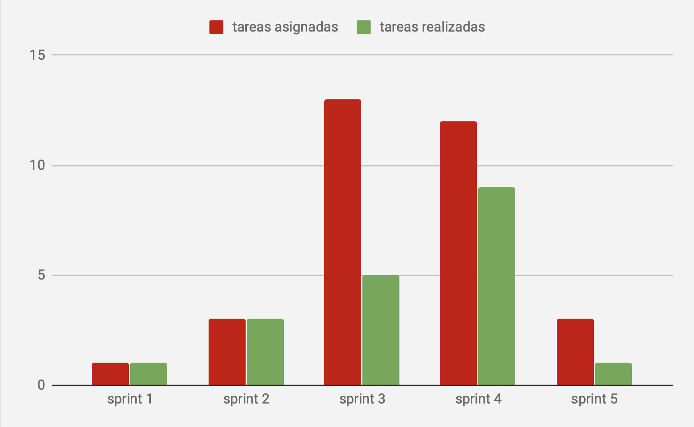

# Ticketera - Sprint 5

## Tareas:

### Principales

-Modificacion del codigo con respecto a la empresa

-Actualizacion de la documentacion de la API

### Plus

## Gráfico de velocidad

## Retrospectiva

Objetivos:

| Tarea                           | Puntaje | Estado |
| ------------------------------- |---------| ------ |
|  Los tickets contienen un conjunto de respuestas |       1 |      1 |
| Técnico - Verificar el traspaso de las funcionalidades del modelo a la API |       1 |      0 |
| Enviar un ticket a un grupo de trabajo |       3 |      0 |

### Mejoras implementadas y conocimientos adquiridos:

-Modificaciones en los tests del modelo, se aumentó la cobertura.

### A mejorar:

-Tests sobre la API

