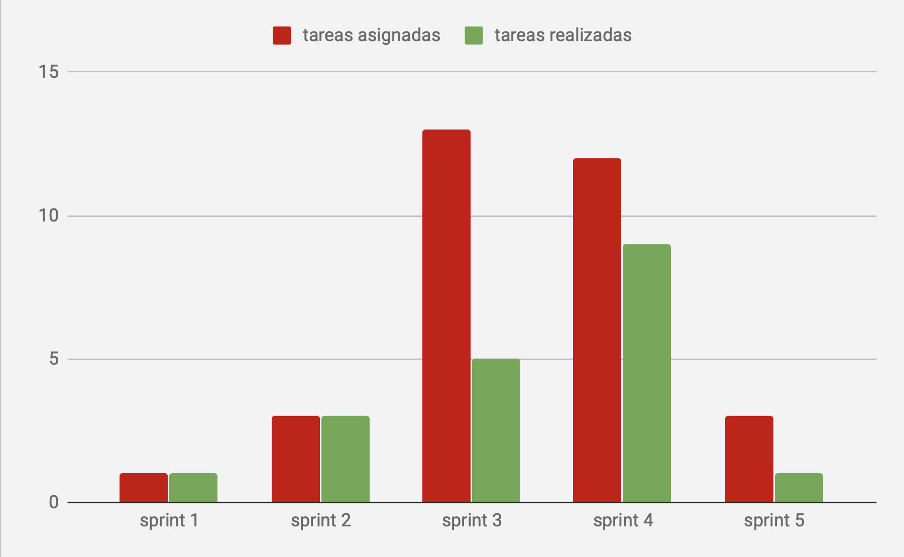

# Ticketera - Sprint 6

## Tareas:

### Principales

Usuario + password para login, imagen

Hash password

Agregar tests postman a travis, automatizar y aumentar la cobertura

Agregar respuesta a los tickets (como comentario o final)

Agregar permisos al cliente para que pueda ver las pizarras

### Plus

## Gráfico de velocidad

## Retrospectiva

Objetivos:

| Tarea                           | Puntaje | Estado |
| ------------------------------- |---------| ------ |
|   |       1 |      1 |
|  |       1 |      0 |
|  |       3 |      0 |

### Mejoras implementadas y conocimientos adquiridos:

### A mejorar:

